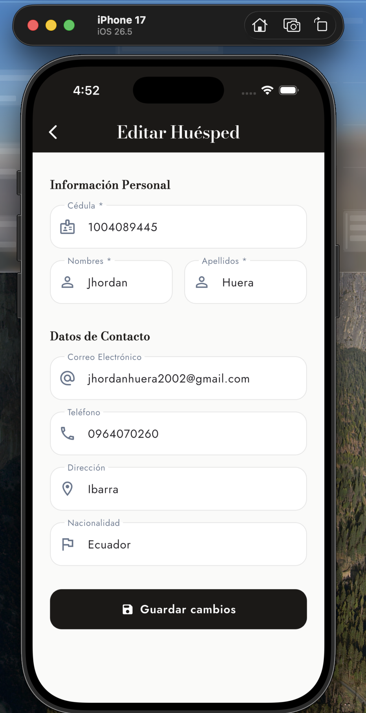
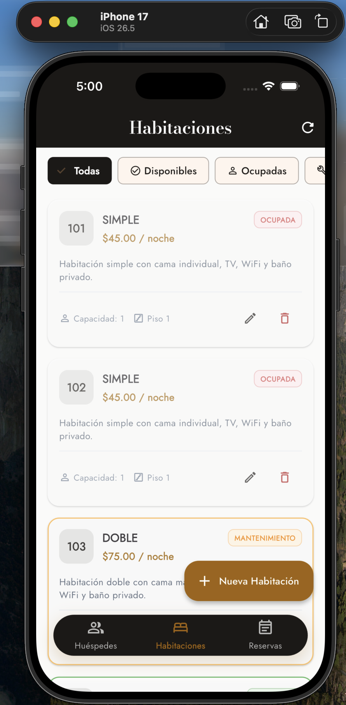
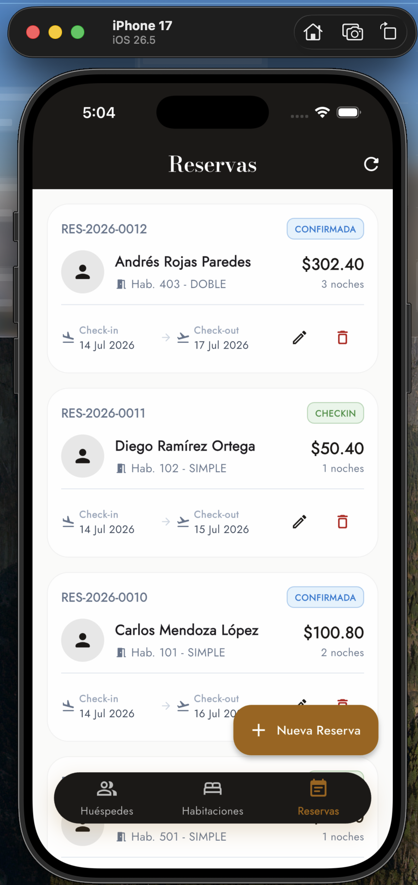

# Reporte de Funcionamiento - Hotel Admin App

Este documento presenta las evidencias visuales del funcionamiento de la aplicación móvil de administración de hotel.

## 1. Gestión de Huéspedes
Lista principal de los huéspedes registrados en el sistema. Permite visualizar la información de contacto, editar y eliminar registros.

*Figura 1: Pantalla de Lista de Huéspedes con diseño responsivo.*

## 2. Formularios (Crear y Editar)
Interfaz para el ingreso y modificación de datos tanto para huéspedes, habitaciones y reservas.

*Figura 2: Pantalla de formulario para crear/editar registros.*

## 3. Gestión de Habitaciones
Visualización del estado y listado de las habitaciones disponibles en el hotel.

*Figura 3: Pantalla de visualización de Habitaciones.*

## 4. Gestión de Reservas
Control y registro de las reservaciones realizadas.

*Figura 4: Pantalla de control de Reservas.*

